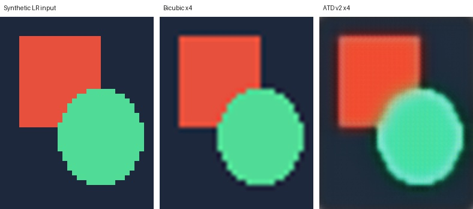

# TPU Super-Resolution

JAX/Flax training scaffold for x4 image super-resolution on Cloud TPU. The
main model family is an ATD v2-style restoration transformer with local
shifted-window attention, adaptive dictionary refinement, token-dictionary
cross attention, and pixel-shuffle upsampling.

The current practical target is real-world phone-photo restoration: noisy or
compressed LR input goes in, clean HR x4 output comes out. The repository keeps
code and docs only; datasets, checkpoints, W&B logs, and personal samples are
ignored by git.

## Minimum System Requirements

Recommended for the full real-world ATD v2 training recipe:

- Host RAM: 50 GB or more recommended
- TPU HBM/device memory: 20 GB or more recommended
- Disk: 30 GB or more for SIDD Small, or 120 GB+ for SIDD Medium plus checkpoints
- Python: 3.10 or newer

Smaller CPU smoke tests and tiny model checks need much less, but the xlarge and
xxlarge training commands below assume a reasonably large TPU VM.

## What Is Included

- `train.py`: TPU-friendly JAX/Flax training loop with W&B logging.
- `infer.py`: checkpoint inference on files or folders, with optional tiling and bicubic comparisons.
- `train_refiner.py`: trains a small residual cleanup model on top of a frozen SR checkpoint.
- `infer_refiner.py`: inference for base SR checkpoint plus residual refiner checkpoint.
- `sr_tpu/model.py`: EDSR-lite, HAT/ATD-style, and ATD v2-style model presets.
- `sr_tpu/refiner.py`: residual refiner blocks for denoise/detail/color polish.
- `sr_tpu/data.py`: HR-only and noisy/clean pair data loaders with synthetic degradation.
- `prepare_dataset.py`: prepares DIV2K/OST-style HR folders.
- `download_real_datasets.py`: downloads supported real-world restoration datasets.
- `prepare_real_dataset.py`: builds SIDD noisy/GT pair manifests for real-world training.

## Hardware

Recommended:

- Linux TPU VM with Python 3.10+
- Cloud TPU runtime visible to JAX
- 30 GB+ free disk for SIDD Small plus checkpoints
- Enough host RAM if using `--preload-data`

CPU works for smoke tests only. Full ATD v2 xlarge/xxlarge training is intended
for TPU.

## Installation

Clone the repository:

```bash
git clone https://github.com/BitIntx/sr-tpu.git
cd sr-tpu
```

Create and activate a virtual environment:

```bash
python3 -m venv ~/venvs/tpu-jax
source ~/venvs/tpu-jax/bin/activate
python -m pip install --upgrade pip setuptools wheel
```

Install the TPU/JAX training stack:

```bash
pip install -r requirements.txt
```

Optional perceptual metrics for `--net-perceptual-metrics all`:

```bash
pip install -r requirements-metrics.txt
```

Check that JAX sees the accelerator:

```bash
python - <<'PY'
import jax
print(jax.__version__)
print(jax.default_backend())
print(jax.devices())
PY
```

Log in to W&B if you want online logging:

```bash
wandb login
```

If no W&B login exists, `--wandb` falls back to offline mode.

## Smoke Test

Run a CPU-only smoke test first. This verifies imports, model init, data loading,
training, eval, sample logging, and checkpoint writing without touching the TPU.

```bash
JAX_PLATFORMS=cpu python train.py \
  --model-preset atd_v2_tiny \
  --out /tmp/sr_tpu_smoke \
  --crop-size 128 \
  --batch-size 1 \
  --steps 2 \
  --log-every 1 \
  --eval-every 0 \
  --save-every 2 \
  --no-preload-data \
  --progress off
```

## Real-World SIDD Training Data

The recommended first real-world run uses SIDD Small sRGB noisy/GT pairs plus a
small set of clean HR self-pairs. SIDD teaches real phone noise; clean self-pairs
add more general texture/detail examples.

Download SIDD Small sRGB:

```bash
python download_real_datasets.py \
  --dataset sidd-small-srgb \
  --root ~/datasets/sr/real
```

Prepare pair manifests:

```bash
python prepare_real_dataset.py \
  --sidd-root ~/datasets/sr/real/sidd-small-srgb \
  --clean-hr-root ~/datasets/sr/prepared/sr_x4_v1/train_mixed_hr \
  --out ~/datasets/sr/prepared/sr_real_x4_v1 \
  --min-side 256 \
  --sidd-repeat 16 \
  --clean-limit 3000 \
  --overwrite
```

If you do not have the older DIV2K/OST prepared folder, omit
`--clean-hr-root`; SIDD-only training still works.

Expected output:

```text
~/datasets/sr/prepared/sr_real_x4_v1/
  train_pairs/pairs.jsonl
  val_pairs/pairs.jsonl
  metadata.json
```

The loader auto-detects `pairs.jsonl`. For SIDD rows it crops aligned
noisy/clean images, downsamples the noisy crop to LR, and trains toward the
clean HR crop. For clean self-pairs, the same image is used as source/target and
phone-like LR degradation is synthesized.

Larger SIDD Medium recipe:

```bash
python download_real_datasets.py \
  --dataset sidd-medium-srgb \
  --root ~/datasets/sr/real \
  --extract

python prepare_real_dataset.py \
  --sidd-root ~/datasets/sr/real/sidd-medium-srgb \
  --clean-hr-root ~/datasets/sr/DIV2K/DIV2K_train_HR \
  --clean-hr-root ~/datasets/sr/OST/extracted/OutdoorSceneTrain_v2 \
  --out ~/datasets/sr/prepared/sr_real_x4_v3_sidd_medium \
  --min-side 256 \
  --val-ratio 0.05 \
  --sidd-repeat 16 \
  --clean-limit 10000 \
  --overwrite
```

## Train

Recommended first real-denoise x4 run:

```bash
python train.py \
  --model-preset atd_v2_xlarge \
  --data ~/datasets/sr/prepared/sr_real_x4_v1/train_pairs \
  --val-data ~/datasets/sr/prepared/sr_real_x4_v1/val_pairs \
  --out checkpoints/atd_v2_xlarge_sidd_real_x4 \
  --scale 4 \
  --crop-size 256 \
  --batch-size 2 \
  --steps 200000 \
  --steps-per-epoch 2000 \
  --lr 2e-5 \
  --warmup-steps 8000 \
  --grad-clip-norm 0.25 \
  --skip-grad-norm 15 \
  --skip-loss-threshold 0.8 \
  --degradation mixed-denoise \
  --edge-loss-weight 0.02 \
  --detail-loss-weight 0.08 \
  --spectrum-loss-weight 0.02 \
  --base-divergence-weight 0.0 \
  --net-perceptual-metrics all \
  --log-every 25 \
  --eval-every 500 \
  --save-every 1000 \
  --wandb \
  --wandb-run-name atd_v2_xlarge_sidd_real_x4
```

If `requirements-metrics.txt` is not installed, remove
`--net-perceptual-metrics all`.

For a heavier run:

```bash
python train.py \
  --model-preset atd_v2_xxlarge \
  --data ~/datasets/sr/prepared/sr_real_x4_v1/train_pairs \
  --val-data ~/datasets/sr/prepared/sr_real_x4_v1/val_pairs \
  --out checkpoints/atd_v2_xxlarge_sidd_real_x4 \
  --scale 4 \
  --crop-size 256 \
  --batch-size 2 \
  --steps 250000 \
  --steps-per-epoch 2000 \
  --lr 1.5e-5 \
  --warmup-steps 12000 \
  --grad-clip-norm 0.25 \
  --skip-grad-norm 15 \
  --skip-loss-threshold 0.8 \
  --degradation mixed-denoise \
  --edge-loss-weight 0.02 \
  --detail-loss-weight 0.08 \
  --spectrum-loss-weight 0.02 \
  --base-divergence-weight 0.0 \
  --log-every 25 \
  --eval-every 500 \
  --save-every 1000 \
  --wandb \
  --wandb-run-name atd_v2_xxlarge_sidd_real_x4
```

## Inference

The checkpoints are JAX/Flax checkpoints, so inference is not TPU-only. They can
run on CPU, NVIDIA GPU, or TPU as long as JAX is installed with the matching
backend. For GPU inference, install the CUDA-enabled JAX wheel first, then the
shared inference dependencies:

```bash
python3 -m venv ~/venvs/sr-tpu-infer
source ~/venvs/sr-tpu-infer/bin/activate
pip install --upgrade pip
pip install --upgrade "jax[cuda13]"
pip install -r requirements-infer.txt
```

For CPU-only inference, replace the JAX install line with `pip install -U jax`.
For TPU VM inference, use `pip install -U "jax[tpu]"`.

Upscale one image:

```bash
python infer.py \
  --checkpoint checkpoints/atd_v2_xlarge_sidd_real_x4 \
  --input path/to/input.jpg \
  --output samples/input_x4.png
```

Compare model output against bicubic on a folder:

```bash
python infer.py \
  --checkpoint checkpoints/atd_v2_xlarge_sidd_real_x4 \
  --input path/to/images \
  --output samples/atd_v2_sidd_check \
  --save-bicubic \
  --compare
```

For large photos, tile the LR input:

```bash
python infer.py \
  --checkpoint checkpoints/atd_v2_xlarge_sidd_real_x4 \
  --input path/to/images \
  --output samples/final_x4 \
  --platform gpu \
  --tile-size 128 \
  --tile-overlap 16 \
  --save-bicubic \
  --compare
```

`infer.py` writes restored images plus `metrics.csv` for folder or
multi-checkpoint runs. Comparison sheets are saved under `output/compare/`.

## Example Output

This synthetic example is included so the repository has a small, redistributable
visual preview without personal `usr_samples` or dataset-derived crops.



The shown model output was produced from an early SIDD real-world restoration
checkpoint and is illustrative, not a benchmark result.

## Model Presets

Approximate parameter counts:

```text
hat_atd_tiny:    0.34M
hat_atd_base:    2.59M
hat_atd_large:  15.30M
hat_atd_xlarge: 42.11M
hat_atd_xxlarge:73.95M
atd_v2_tiny:     0.43M
atd_v2_base:    13.02M
atd_v2_large:   29.90M
atd_v2_xlarge:  57.36M
atd_v2_xxlarge: 97.96M
```

ATD v2 presets default to `global_residual=False`, so the model predicts the
full HR image rather than hiding behind a cubic skip path.

`crop-size / scale` must be divisible by `window-size`. With the defaults,
`crop-size=256`, `scale=4`, and `window-size=8`, LR patches are `64x64`.

## Data Modes

`--degradation` options:

- `bicubic`: classical x4 bicubic downsample.
- `mixed-light`: mild blur/JPEG/noise.
- `mixed-real`: stronger blur, resize kernels, JPEG, RGB/chroma noise, color jitter.
- `phone-real`: heavier phone-like degradation with JPEG/WebP, noise, banding, blur, and sharpening artifacts.
- `mixed-balanced`: mix of bicubic, mixed-light, and mixed-real.
- `mixed-sharp`: mostly bicubic/light degradation to retain sharpness.
- `mixed-denoise`: mostly phone-real plus mixed-real and a little bicubic.

For noisy phone photos, start with `mixed-denoise`.

## W&B Logs

Common logged metrics:

```text
train/loss, train/pixel_loss, train/edge_loss, train/detail_loss
train/psnr, train/lr, train/grad_norm, train/base_mae
eval/loss, eval/psnr, eval/bicubic_psnr, eval/psnr_gain_vs_bicubic
eval/ssim, eval/ms_ssim, eval/color_delta_e
eval/images
samples/usr_samples
```

Place your own LR images in `usr_samples/` if you want periodic qualitative
logging. That directory is ignored by git.

## Residual Refiner

`train_refiner.py` trains a small residual model on top of a frozen SR checkpoint.
The base model handles x4 structure; the refiner only predicts a bounded cleanup
residual for denoise/detail/color polish.

With `--crop-size 256 --scale 4`, the full path is LR `64x64` -> frozen ATD
base `256x256` -> refiner `256x256`. The refiner does not upscale by itself; it
polishes the base output at final HR resolution.

Example using the ATD v2 xlarge SIDD Medium base:

```bash
python train_refiner.py \
  --base-checkpoint ~/dev/sr-tpu/checkpoints/atd_v2_xlarge_real_v3_sidd_medium_long_x4/checkpoint_400000 \
  --data ~/datasets/sr/prepared/sr_real_x4_v3_sidd_medium/train_pairs \
  --val-data ~/datasets/sr/prepared/sr_real_x4_v3_sidd_medium/val_pairs \
  --out checkpoints/atd_v2_xlarge_refiner_phone_real_x4 \
  --scale 4 \
  --crop-size 256 \
  --batch-size 2 \
  --steps 200000 \
  --lr 8e-5 \
  --warmup-steps 3000 \
  --degradation phone-real \
  --refiner-features 64 \
  --refiner-blocks 10 \
  --refiner-residual-scale 0.25 \
  --log-every 25 \
  --eval-every 1000 \
  --save-every 5000 \
  --keep-checkpoints 20 \
  --wandb \
  --wandb-run-name atd_v2_xlarge_refiner_phone_real_x4
```

Inference with base + refiner:

```bash
python infer_refiner.py \
  --base-checkpoint checkpoints/atd_v2_xlarge_real_v3_sidd_medium_long_x4/checkpoint_400000 \
  --refiner-checkpoint checkpoints/atd_v2_xlarge_refiner_phone_real_x4/checkpoint_100000 \
  --input usr_samples \
  --output samples/refiner_preview \
  --compare \
  --save-base \
  --save-bicubic
```

## Checkpoints And Artifacts

These paths are intentionally ignored:

```text
checkpoints/
wandb/
samples/
usr_samples/
data/
*.zip
*.ckpt
*.msgpack
```

Keep trained weights in GitHub Releases, cloud storage, or W&B Artifacts rather
than committing them to the repository.

## Notes

- TPU compile happens on the first step, so step 1 is much slower than later steps.
- `--preload-data` decodes dataset images into host RAM before training.
- `--data-workers 4` is a good starting point on the TPU VM used for development.
- If training output looks too close to bicubic, inspect `samples/*pred_minus_bicubic*` and increase real degradation or perceptual/detail pressure.
